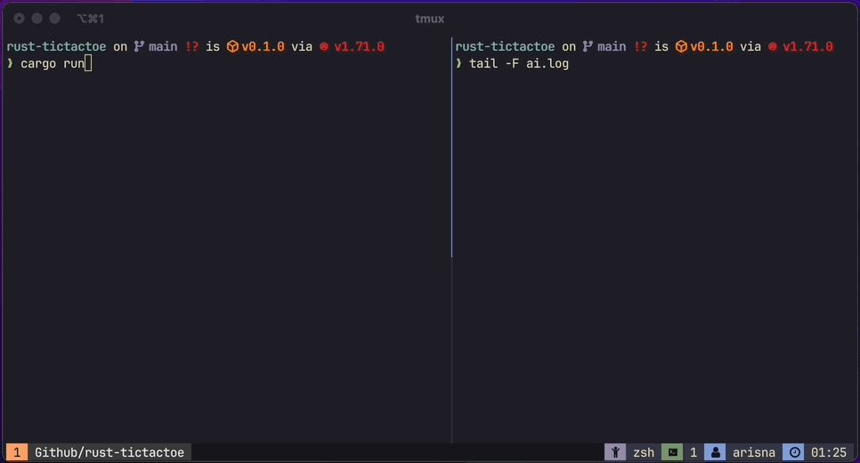

# TICTACTOE GAME


A simple terminal based Tic Tac Toe game build with Minimax algorithm implementation for the A.I. Build with Rust programming language

## How to Install

Makse sure you have Rust and Cargo (version `1.71.0`) installed.

Clone this repository

```bash
git clone https://github.com/arisnacg/rust-tictactoe
```

Set as current directory

```bash
cd rust-tictactoe
```

Use `cargo` to run the project.

```bash
cargon run
```
